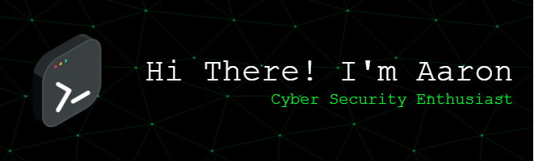

# 💫 About Me
I am an undergraduate student at Telkom University, majoring in Informatics, with a strong passion for Cyber Security. My interests span across various domains, including vulnerability assessment, penetration testing, threat detection, incident response, and securing systems against real-world cyber threats. I am committed to continuously expanding my technical skills, staying updated with the latest developments in the security landscape, and contributing to the field through hands-on projects, research, and collaboration.

## 🌐 Socials
  

# 💻 Tech Stack
      
